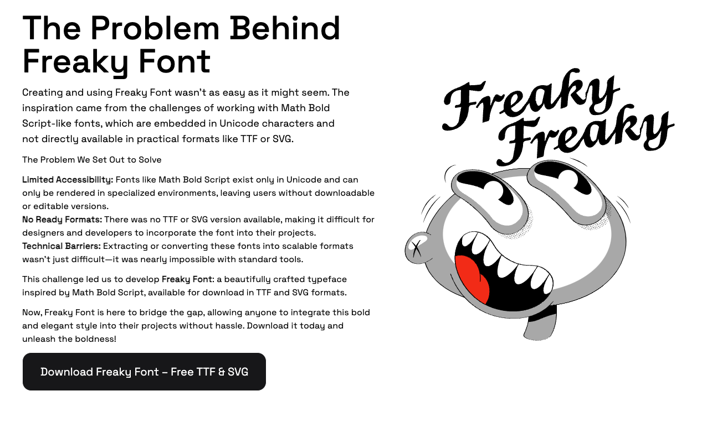

# Freaky Font https://fontfreaky.com 

## About Freaky Font
Freaky Font is a custom typeface inspired by Math Bold Script-like fonts, which are traditionally embedded in Unicode characters and not available in practical formats such as TTF or SVG. This project aims to make these unique fonts accessible to designers and developers.

## The Problem We Set Out to Solve
- **Limited Accessibility**: Fonts like Math Bold Script exist only in Unicode and can only be rendered in specialized environments, leaving users without downloadable or editable versions.
- **No Ready Formats**: There was no TTF or SVG version available, making it difficult for designers and developers to incorporate the font into their projects.
- **Technical Barriers**: Extracting or converting these fonts into scalable formats was nearly impossible with standard tools.

## Our Solution
To overcome these challenges, we developed Freaky Font—a beautifully crafted typeface inspired by Math Bold Script, available for download in TTF and SVG formats. Now, anyone can integrate this bold and elegant style into their projects with ease.

## Installation
1. Download the font files (TTF and SVG) from the repository.
2. Install the TTF file by double-clicking it and selecting "Install" on your system.
3. Use the SVG version in web projects or design tools that support vector fonts.

## Usage
- Compatible with design software like Adobe Illustrator, Photoshop, Figma, and Sketch.
- Can be used in web development projects by embedding the TTF or using the SVG format.
- Suitable for creative typography, branding, and graphic design projects.

## License
Freaky Font is released under the [MIT License](LICENSE), meaning you can freely use, modify, and distribute it.

## Contributing
We welcome contributions! If you have ideas for improvements, feel free to submit a pull request or open an issue.

## Download
Download **Freaky Font** today and unleash the boldness!

[Download Freaky Font – Free TTF & SVG](https://fontfreaky.com/public/FreakyFont.zip)

## Contact
If you have any questions or suggestions, feel free to reach out or open an issue in the repository.

---
Enjoy using **Freaky Font**!

